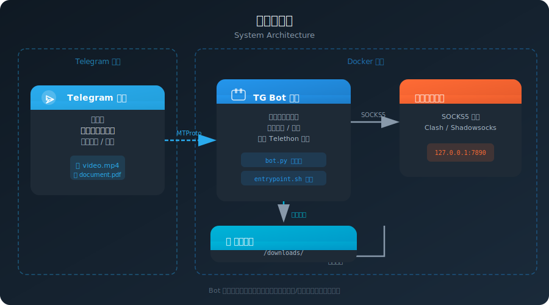
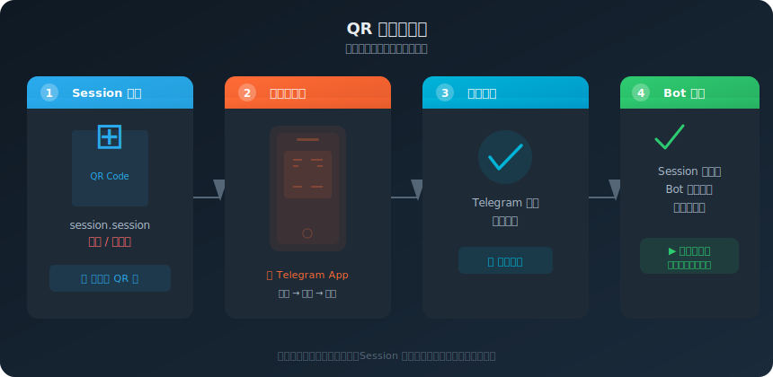
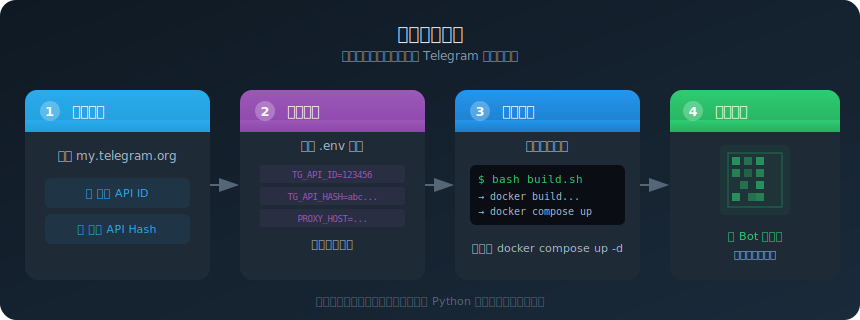

<p align="center">
  
</p>

<h1 align="center">TG Bot Downloader</h1>

<p align="center">
  <b>📥 全功能 Telegram 视频 / 文档自动下载机器人</b><br>
  监听「已保存消息」，自动下载视频和文档，支持断点续传、t.me 链接下载、查重去重<br>
  一行 Docker 命令部署，QR 码扫码即登
</p>

<p align="center">
  <a href="#"></a>
  <a href="#"></a>
  <a href="#"></a>
  <a href="#"></a>
</p>

---

## 📋 功能一览

| 功能 | 说明 |
|---|---|
| 🎯 **精准监听** | 只监听「已保存消息」（Saved Messages），不干扰其他对话 |
| 📹 **自动下载** | 视频、文档一旦出现，Bot 自动下载到本地 |
| 🔗 **t.me 链接下载** | 把频道/群组的消息链接发到「已保存消息」，Bot 自动解析并下载（支持禁止转发的频道） |
| 📶 **断点续传** | 下载中断后保留 `.part` 缓存文件，下次继续从断点下载，不浪费流量 |
| 📊 **下载进度** | 实时显示下载百分比和速度，大文件心里有数 |
| 🔄 **查重去重** | 同一视频不会重复下载，但文件被删后会自动重新下载 |
| 🚀 **启动自动续传** | 容器启动时自动扫描未完成的下载并恢复，结合下载映射精准定位 |
| 🪄 **文件引用自动刷新** | 遇到 Telegram 文件引用过期时自动刷新并继续下载，无需手动干预 |
| 📱 **QR 码登录** | Session 失效时自动生成 QR 码，手机扫码即登，无需短信验证码 |
| 🔌 **自动重连** | 连接断开后自动重连，7×24 稳定运行 |
| 🌐 **代理支持** | 内置 SOCKS5 代理支持（Clash / Shadowsocks 等），网络受限环境也能用 |
| 📦 **即拉即用** | 一行命令构建启动，无需手动安装 Python 依赖 |

---

## 🏗️ 系统架构

<p align="center">
  
</p>

**工作流程：**
1. 用户向 Telegram 的「已保存消息」发送视频或文档
2. Bot 容器通过 Telethon 库监听新消息
3. 检测到视频/文档后，通过代理（可选）调用 MTProto 协议下载文件
4. 文件自动保存到本地的 `/downloads/` 目录

---

## 📲 QR 码登录流程

<p align="center">
  
</p>

**免短信验证码，扫码即登。** Session 持久化保存后，重启容器也无需再次登录。

---

## 🚀 快速部署

<p align="center">
  
</p>

### 前置要求

- [Docker](https://www.docker.com/) 和 [Docker Compose](https://docs.docker.com/compose/)（已安装）
- [Telegram API 凭据](https://my.telegram.org/apps)（免费申请）

### 第一步：克隆仓库

```bash
git clone https://github.com/<你的用户名>/tg-bot-downloader.git
cd tg-bot-downloader
```

### 第二步：配置环境变量

复制模板并填入你的 Telegram API 凭据：

```bash
cp .env.example .env
```

编辑 `.env` 文件：

```ini
# Telegram API 凭据（必需）
TG_API_ID=12345678              # 填入你的 API ID
TG_API_HASH=abcdef1234567890    # 填入你的 API Hash

# 代理配置（可选，不用代理则留空）
TG_PROXY_HOST=127.0.0.1
TG_PROXY_PORT=7890
```

> ⚠️ `.env` 文件包含敏感信息，已被 `.gitignore` 排除，不会提交到仓库。

### 第三步：构建 & 启动

```bash
# 一键脚本（推荐）
bash build.sh
```

或者手动操作：

```bash
# 构建镜像
docker build -t tg-bot-downloader:latest .

# 启动容器
docker compose up -d
```

### 第四步：QR 码登录

首次启动后查看生成的 QR 码：

```bash
# Linux
xdg-open ./downloads/tg-bot-login-qr.png

# macOS
open ./downloads/tg-bot-login-qr.png

# Windows
start ./downloads/tg-bot-login-qr.png
```

用手机 **Telegram App → 设置 → 设备 → 扫描二维码** 扫码即可完成登录。

> ✅ 登录后 `session.session` 自动保存，下次重启无需再次扫码。

### 第五步：验证运行

向「已保存消息」发送一个视频文件，检查下载目录：

```bash
ls -la ./downloads/
```

查看容器日志确认运行状态：

```bash
docker logs -f tg-bot
```

---

## 📁 项目结构

```
tg-bot-downloader/
├── Dockerfile           # 镜像构建文件（多架构通用）
├── docker-compose.yml   # Docker Compose 编排配置
├── bot.py               # Bot 主程序（Telethon 监听 + 下载）
├── entrypoint.sh        # 容器启动脚本（等待代理就绪）
├── build.sh             # 一键构建部署脚本
├── .env.example         # 环境变量模板（复制为 .env 后使用）
├── .gitignore           # Git 忽略规则
├── LICENSE              # MIT 开源协议
├── README.md            # 本文档
└── assets/
    ├── architecture.svg     # 系统架构图
    ├── qr-login-flow.svg    # QR 码登录流程图
    └── deployment-flow.svg  # 部署流程图
```

---

## ⚙️ 环境变量

| 变量 | 必需 | 默认值 | 说明 |
|---|---|---|---|
| `TG_API_ID` | ✅ | — | Telegram API ID，从 [my.telegram.org](https://my.telegram.org/apps) 获取 |
| `TG_API_HASH` | ✅ | — | Telegram API Hash，与 API ID 在同一页面获取 |
| `TG_PROXY_HOST` | ❌ | `127.0.0.1` | SOCKS5 代理主机地址（不需要则留空） |
| `TG_PROXY_PORT` | ❌ | `7890` | SOCKS5 代理端口 |
| `TG_DOWNLOAD_PATH` | ❌ | `/downloads` | 下载文件保存目录 |
| `TG_SESSION_PATH` | ❌ | `/app/session` | Session 文件路径（默认与 volume 映射匹配） |

---

## 🧪 手动部署（不使用 Docker Compose）

```bash
docker run -d \
  --name tg-bot \
  --network host \
  -v $(pwd)/session.session:/app/session.session \
  -v $(pwd)/downloads:/downloads \
  --env-file .env \
  tg-bot-downloader:latest
```

---

## ❓ 常见问题

**Q: 怎么用 t.me 链接下载视频？**

A: 将频道/群组中某个视频消息的链接复制，发到你的「已保存消息」，Bot 会自动解析链接并下载该视频。即使频道设置了禁止转发也能下载。

**Q: 下载中断了怎么办？**

A: 不用担心。Bot 支持断点续传，中断时会保留 `.part` 缓存文件。下次启动容器或收到同一文件时，会自动从断点继续下载。同时启动时会自动扫描未完成的下载并恢复。

**Q: 重复发送同一个视频会重复下载吗？**

A: 不会。Bot 会记录已下载的文件 ID，同一视频不会重复下载。但如果本地文件已被删除，Bot 会重新下载。

**Q: Session 失效了怎么办？**

A: 删除 `session.session` 文件，重启容器，它会自动生成新的 QR 码等待扫码。

**Q: 容器一直重启？**

A: 检查代理是否正常运行。如果不用代理，将 `.env` 中的 `TG_PROXY_HOST` 和 `TG_PROXY_PORT` 留空。

**Q: 支持 amd64 吗？**

A: 支持。`Dockerfile` 未锁定平台架构，默认使用宿主机架构构建。

**Q: 怎么更新 Bot？**

A: 拉取最新代码后重新构建即可：
```bash
git pull
docker build -t tg-bot-downloader:latest .
docker compose down && docker compose up -d
```

---

## 📄 License

[MIT](LICENSE)

---

<p align="center">
  如果这个项目对你有帮助，欢迎 ⭐ Star 支持！
</p>
